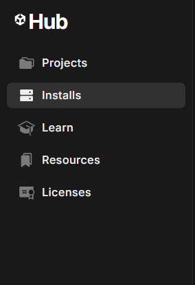
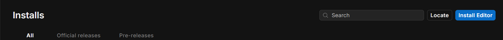
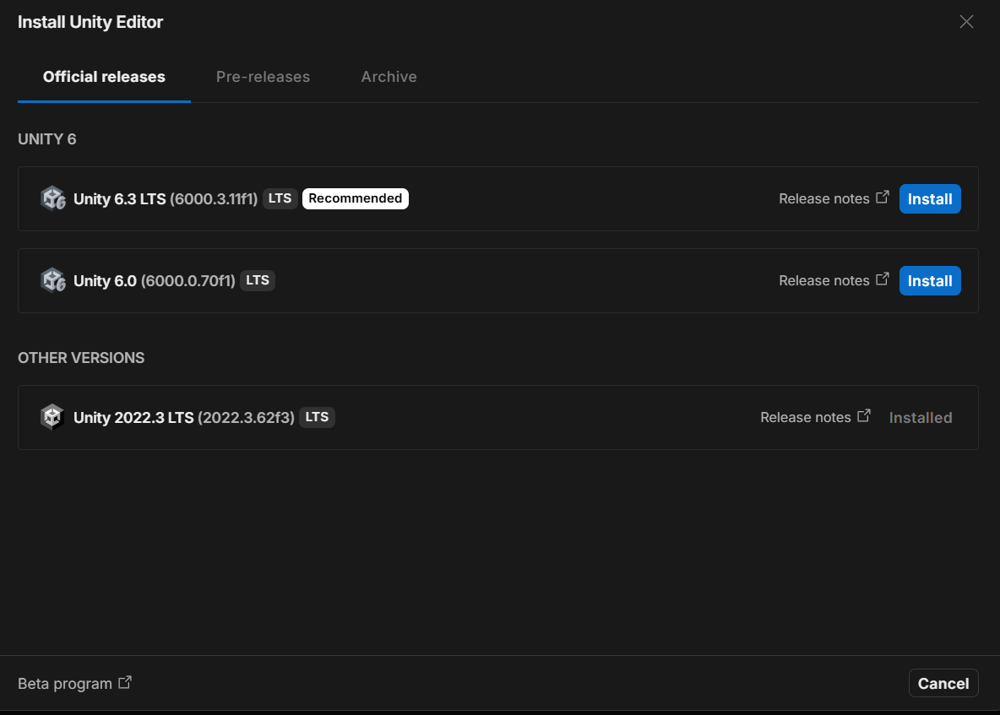

1. Go to the Official Unity Website: https://unity.com/ click on download untiy on top right side

for your reference a document has been attached to check for the system requirements for unity:
https://docs.unity3d.com/6000.3/Documentation/Manual/system-requirements.html

2.  Download Unity Hub

3.  When inside go to installs tab:

4.  Then on the top right click on install editor

5.  Then When you click on install editor the below window will open up , keep in mind to install only from the "official release" tab as those work best.

